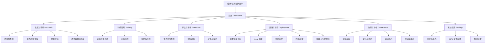
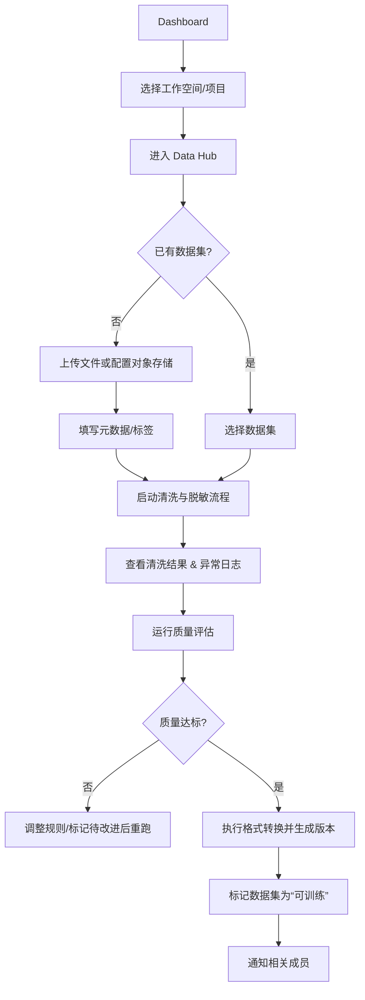
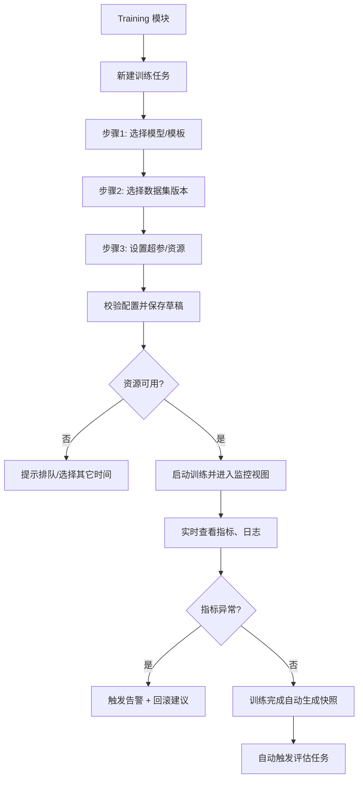
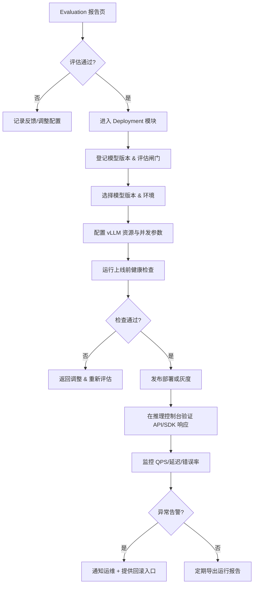

# llm-finetune-platform UX/UI Specification

_Generated on 2025-10-23 by zephyr_

## Executive Summary

- 平台定位：面向企业的“大语言模型微调一站式平台”，提供数据准备、微调执行、评估报告与部署运营全链路能力。  
- 核心目标：让缺乏资深模型经验的团队在 2 周内跑通一次微调闭环，同时沉淀可对外交付的标准化方案。  
- UX 重点：构建引导式、可信赖、协作友好的管理台，突出流程透明与质量守护；兼顾专业用户的效率操作与业务方的可视化洞察。

---

## 1. UX Goals and Principles

### 1.1 Target User Personas

| Persona | 角色职责 | 典型痛点 | 关键需求 |
|---------|----------|----------|----------|
| **企业数据科学家**（Primary） | 负责整理语料并执行微调实验 | 工具链零散、配置繁琐、担心把模型调坏 | 一站式流程、可复用模板、训练质量守护 |
| **平台运维工程师**（Primary） | 管理 GPU 资源、部署模型、监控性能 | 多个脚本手动操作、缺少统一监控 | 可控的部署管线、告警回滚、性能仪表盘 |
| **业务产品经理/负责人**（Secondary） | 关注业务收益与交付进度 | 无法理解模型是否提升、沟通成本高 | 可视化报告、进度可见、审批与评论 |
| **生态合作伙伴/交付顾问**（Secondary） | 为客户搭建 PoC、复用最佳实践 | 每个项目重复搭建、缺少模板 | 模板库、知识沉淀、易于展示的演示环境 |

### 1.2 Usability Goals

- 新手在 1 天内完成培训，独立完成一次“数据→训练→评估→部署”操作。  
- 专业用户可在 5 分钟内复制历史配置并启动新训练。  
- 关键质量指标（loss、评估分数）实时可见且可追溯。  
- 支持至少 WCAG 2.1 AA 的可访问性，保证键盘操作与屏幕阅读。  
- 关键操作（上线、回滚、删除数据）必须确认并可撤销。

### 1.3 Design Principles

1. **Guided Flow**：使用向导与显性提示降低学习成本。  
2. **Trusted Transparency**：清晰展示数据、训练、评估、部署的状态与影响。  
3. **Modular Efficiency**：提供模板与快捷操作满足熟练用户效率。  
4. **Collaborative Visibility**：突出责任人、评论、审批与通知信息。  
5. **Inclusive & Accessible**：配色、对比度与交互遵守可访问性规范。

---

## 2. Information Architecture

### 2.1 Site Map

### 2.2 Navigation Structure

- **主导航（左侧侧边栏／顶部切换）**：Dashboard、Data Hub、Training、Evaluation、Deployment、Governance、Settings。  
- **次导航**：在每个模块内部使用页签（如“概览 / 清洗 / 质量”）、面包屑用于深层页面（例如数据集详情）。  
- **Deployment 子导航**：包含“模型版本仓库 / vLLM 部署 / 推理 API 控制台 / 性能监控 / 回滚”，其中“推理 API 控制台”支持调试推理、管理 API Key 与查看调用统计。  
- **移动导航**：采用底部主导航 + 抽屉式二级菜单；重要图表改用折叠与卡片布局。  
- **面包屑策略**：`工作空间 > 模块 > 子页面 > 具体实体`，便于从详情返回列表。

---

## 3. User Flows

### Flow 1：导入语料并完成数据准备

> 当前实现：`DatasetUploadPage` 提供多源导入表单，支持上传文件、填写对象存储地址或引用已有数据集，并在完成后引导用户立即触发清洗流水线。
> 新增实现：`QualityDashboardPage` 展示清洗完成后的质量指标（总样本、重复率、缺失率等）与异常样本列表，支持重新触发评估和下载 JSON/CSV 报告。

### Flow 2：配置并启动微调任务

> 向导的“步骤3：设置超参/资源”需提供 GPU 数量与训练队列选择（default / high-memory / spot），并在前端即时反馈是否超出平台限制。  
> 新增实现：`TrainingSnapshotsPage` 汇总训练快照，支持筛选工作空间、查看指标摘要、填写备注后发起断点续训与一键回滚，并在操作成功后提示下一步（重新评估/监控告警）。

### Flow 3：部署模型并监控上线表现

- 模型仓库页：提供工作空间/项目筛选、状态过滤、模型卡片与版本时间轴；支持一键升级/降级状态、导出 JSON/Markdown Manifest、跳转至评估报告或部署视图。版本状态切换按钮在 UI 上清晰区分候选、生产、废弃状态，并提示评估闸门校验结果。  
- 部署管理页（`/deployment`）：左侧表单包含模型版本选择（默认拉取生产版本列表）、环境与资源配置（GPU 配额、最大并发、批量大小、部署备注），提交后以 toast + 状态行反馈；右侧展示部署状态卡片（Endpoint/Token、健康检查时间、流量百分比）、最近事件时间线与监控入口。关键操作（部署、调节流量、回滚）提供确认对话框并支持键盘操作，Endpoint/Token 附带复制与导出按钮，状态 badge 兼容深色主题对比度。  
- 推理 API 控制台页（`/inference`）：顶部提供工作空间选择与全局反馈提示；主体分为四块——调用统计概览卡片（总调用、成功、限流、平均延迟）、推理调试表单（部署/模型版本 ID、提示词、温度）、API Key 管理（列表 + 新建表单 + 一次性明文提示）以及日志表格（显示调用 ID、状态、延迟、token）。调用或创建密钥后自动刷新相关区块，便于运维与应用开发者快速校验并监控配额。

---

## 4. Component Library and Design System

### 4.1 Design System Approach

- **混合策略**：以 Ant Design 组件库为基础，结合 Tailwind CSS 进行品牌化与布局微调；关键专业组件（如训练监控图、流程看板）自定义实现。  
- 增量建立内部组件文档，规范命名与状态，后续可抽离成 Design System。

### 4.2 Core Components

| 组件 | 用途 | 变体/状态 | 备注 |
|------|------|-----------|------|
| 数据集卡片 & 表格 | 展示上传文件、版本等信息 | 状态：待清洗 / 清洗中 / 可训练 / 有警告；视图：卡片 / 表格 | 支持批量操作、筛选、标签 |
| 数据集导入表单 | 新增/更新数据集入口 | 来源：上传 / 外部链接 / 引用；状态：校验中 / 成功 / 失败 | 提供即时校验、成功反馈与清洗入口 |
| 清洗规则编辑器 | 配置去重、脱敏规则 | 变体：模板模式 / 自定义模式；状态：草稿 / 发布 | 内置语法提示与预览 |
| 训练向导步骤条 | 引导用户完成训练配置 | 状态：完成、当前、禁用；显示校验提示 | 支持保存草稿；资源步骤提供 GPU 数量与队列选择 |
| 实时监控图表 | 展示 loss、困惑度等指标，并在训练卡片中同步最新自动评估（BLEU/ROUGE-L/Exact Match/Perplexity）及阈值告警提示 | 折线图 / 面积图 / 数值卡片；支持自定义阈值 | 可下载 CSV |
| 快照列表卡片 | 展示训练快照与状态 | 状态：可用 / 已回滚；动作：续训 / 回滚 | 展示触发类型、指标摘要、备注与创建时间 |
| 实验对比面板 | 汇总运行元数据、配置差异 | 状态：未选择 / 加载中 / 对比完成；动作：导出 JSON/CSV/Markdown | 展示参数 & 指标 diff，附快照/告警引用链接 |
| 评估报告卡片 | 汇总评估结果及差异 | 状态：通过 / 需要关注 / 不通过 | 支持评论与标记 TODO |
| 模型版本时间轴 | 展示模型版本、部署状态 | 节点状态：候选/生产/废弃；动作：晋升/降级/导出 | 联动查看版本细节、评估/部署入口 |
| 流程看板列 | 显示各环节任务 | 列：待办/进行中/阻塞/完成 | 支持拖拽、指派、截止日期 |
| 通知中心 | 展示任务与告警 | 过滤：全部/告警/审批/系统 | 支持跳转到详情 |

---

## 5. Visual Design Foundation

### 5.1 Color Palette

| 名称 | 角色 | HEX | 说明 |
|------|------|-----|------|
| Primary Blue | 主色 / 行动按钮 | `#1F7AE0` | 传达专业可信 |
| Primary Dark | 次主色 / 顶部导航 | `#123A66` | 深色背景搭配白字 |
| Accent Green | 成功/通过 | `#2EB67D` | 微调成功、评估通过 |
| Accent Orange | 警示/需要关注 | `#F4A259` | 指标波动、待审批 |
| Danger Red | 错误/失败 | `#D64545` | 告警、异常状态 |
| Neutral 100-900 | 背景、分隔、边框 | `#0F172A`, `#1E293B`, `#334155`, ..., `#F1F5F9` | 使用 Tailwind Gray 体系，确保对比度 |

### 5.2 Typography

**Font Families:**  
- 标准文案：`Inter`（无衬线，支持中文 fallback：`"PingFang SC"`/`"Microsoft YaHei"`）  
- 技术内容/代码：`Source Code Pro`

**Type Scale:**

| 用途 | 字体大小 / 行高 | 备注 |
|------|----------------|------|
| H1 页面标题 | 32px / 40px | 关键仪表盘标题 |
| H2 模块标题 | 24px / 32px | 模块/卡片标题 |
| H3 小节标题 | 20px / 28px | 表格/子区域 |
| Body Large | 16px / 24px | 常规正文、按钮 |
| Body Small | 14px / 20px | 表格说明、标签 |
| Caption | 12px / 16px | 状态标签、帮助文案 |

### 5.3 Spacing and Layout

- 栅格：Desktop 12 列，每列 80px，间距 24px；Tablet 8 列；Mobile 4 列。  
- 基础间距单位：8px，关键模块使用 24px 或 32px 留白。  
- 卡片内边距：24px；列表行高：Body 字体 + 12px。  
- 提供固定高度的顶部栏（64px）与侧边栏（固定宽 240px）。

---

## 6. Responsive Design

### 6.1 Breakpoints

- `≤ 576px`：手机  
- `577px - 992px`：平板/小屏幕  
- `≥ 993px`：桌面  
- 针对 2K 以上大屏提供宽屏布局（≥ 1440px）。

### 6.2 Adaptation Patterns

- 手机：主导航折叠为底部标签 + 汉堡菜单；仪表盘卡片改为纵向卡片。  
- 平板：侧边栏可折叠，列表改为卡片/表格切换；图表简化注释。  
- 桌面：保持全功能布局；图表与表格并排显示。  
- 宽屏：仪表盘可启用多列对比视图、同时展示多个监控模块。

---

## 7. Accessibility

### 7.1 Compliance Target

- 目标符合 **WCAG 2.1 AA**：对比度 ≥ 4.5:1、键盘导航、焦点状态、ARIA 标签完善。

### 7.2 Key Requirements

- 所有互动控件带辅助文本及键盘焦点样式；  
- 图表提供数据概览表与文本说明；  
- 关键流程（如训练向导）支持屏幕阅读器朗读步骤；  
- 通知/告警遵守“非阻塞 + 明确说明 + 可关闭”；  
- 提供色盲安全的辅助色，避免仅凭颜色传达状态。

---

## 8. Interaction and Motion

### 8.1 Motion Principles

- 关注反馈：操作完成给出即时反馈（成功/失败/等待）；  
- 控制节奏：导航切换与卡片展开动画不超过 200ms；  
- 重点强化：训练图表阈值触发时，可使用轻微闪烁强调。

### 8.2 Key Animations

- 向导步骤切换：横向滑入/滑出，强化流程感；  
- 告警气泡：淡入 + 微振动提示紧急程度；  
- 看板拖拽：释放时添加 “snap” 动画，帮助用户确认位置。

---

## 9. Design Files and Wireframes

### 9.1 Design Files

- 计划使用 **Figma** 制作高保真设计。  
- 文件结构：`Workspace Overview / Data Hub / Training Wizard / Evaluation Report / Deployment Monitor / Governance Board / Components Library`。  
- 初版 Figma 文件将在 UX 完成后 2 周内上线，暂未创建链接（TBD）。

### 9.2 Key Screen Layouts

**Screen Layout 1：Dashboard 总览**  
- 顶部：工作空间选择、通知入口、用户菜单；  
- 主区：四个卡片（数据准备状态、训练队列、评估结果、部署性能），右侧展示告警与待审批列表；  
- 底部：近期活动时间线。

**Screen Layout 2：Training Wizard（Step-by-Step）**  
- 左侧：步骤导航（模型、数据、参数、资源、审核）；  
- 中部：表单/配置卡片；  
- 右侧：即时提示（推荐参数、历史经验、估算资源）；  
- 底部：上一步/下一步/保存草稿按钮 + 校验提示。

**Screen Layout 3：Evaluation Report**  
- Header：模型信息、评估时间、负责人与“查看关联训练”入口；  
- 上半区：指标对比图（Before vs After）、分数卡，并在右列展示阈值校验状态；  
- 中部：训练元信息卡片（运行编号、基础模型、项目归属）与数据版本卡片（数据集名称、版本号、存储路径）；  
- 下半区：提升案例表格、待改进示例、业务备注（支持折行展示与复制粘贴）；  
- 顶部操作区：Markdown/PDF/JSON 导出按钮、受控分享链接生成与复制反馈；  
- 侧栏（后续扩展）：审批按钮、评论区、导出操作历史。
- 反馈面板：展示评论/TODO/业务指标列表，支持筛选、标记完成、导出知识库并一键将条目复制至训练备注。

**Screen Layout 4：Standardized Evaluation Suite（Story 4.1 新增）**  
- Header：显示页面标题与所选工作空间摘要，右上角展示项目数量、评估提示；  
- 主区左上方：模块内导航（评估套件/后续扩展入口），支持键盘焦点与高对比度；  
- 创建任务表单：模板选择、项目/训练运行绑定、数据集版本下拉、文件上传控件和错误提示，提交后展示成功/失败反馈；  
- 任务列表：表格列出任务编号、模板、指标、状态（颜色区分 completed/failed/pending），行动列提供 Markdown/JSON 下载按钮；自动创建的任务以 “自动” 徽章标注，指标列显示 BLEU/ROUGE-L/Exact Match/Perplexity，并在阈值触发时给出醒目提示；  
- 空状态：在无任务时提供说明文案与“创建评估任务”指引；加载状态使用 Skeleton 或提示文案，保持无障碍朗读顺序。  

---

## 10. Next Steps

### 10.1 Immediate Actions

1. 建立 Figma 设计文件并导入上述布局，完成基础组件库。  
2. 与业务团队确认评估报告所需字段与布局优先级。  
3. 与工程团队对齐训练向导字段、API 返回结构，为 UI 接口定义做准备。  
4. 准备色彩/字体 token，供前端 Tailwind 主题配置使用。

### 10.2 Design Handoff Checklist

- [x] 用户流程已记录（Flow 1-3）。  
- [x] 核心组件与状态定义。  
- [x] 无障碍与响应式策略明确。  
- [ ] Figma 高保真稿（待制作）。  
- [x] 设计系统选型与样式基线确定。  
- [x] 后续行动项已列出。

---

## Appendix

### Related Documents

- PRD: `docs/PRD.md`  
- Epics: `docs/epics.md`  
- Tech Decisions: `docs/technical-decisions.md`  
- Product Brief: `docs/product-brief-llm-finetune-platform-2025-10-23.md`

### Version History

| Date       | Version | Changes                   | Author |
|------------|---------|---------------------------|--------|
| 2025-10-23 | 1.0     | Initial UX specification  | zephyr |
